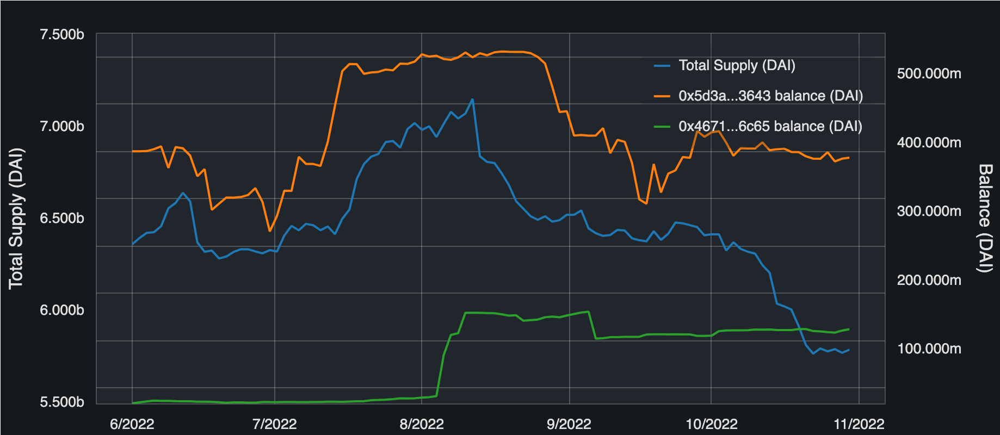

Welcome to Web3cat!
===================
.. image:: https://readthedocs.org/projects/web3cat/badge/?version=latest
    :target: https://web3cat.readthedocs.io/en/latest/?badge=latest
    :alt: Documentation Status

.. image:: /docs/images/web3cat.png
    :width: 180

**Meow, fellow researcher!**

Web3cat is a framework for fetching and analyzing blockchain data.

Currently, it supports only EVM chains: `Ethereum <https://ethereum.org>`_,
`Polygon <https://polygon.technology>`_, `BNB <https://www.bnbchain.org>`_, etc.

Design philosophy
-----------------

#. Visualize the data with minimum code
#. Free for downloading, saving, and analyzing the data however you want
#. Cache the data to avoid re-fetching anything at all
#. Fully decentralized, that is, depending only on the blockchain RPC

Quick demo
----------
.. image:: /docs/images/web3cat_demo.gif

Getting started
---------------

1. Install python package 

.. code::

    pip install web3cat

2. Set up your archive node rpc. The easiest (and also free) way is to use
   `Alchemy <https://alchemy.com>`_.

3. Set initial configuration

.. code::

    import os
    os.environ['WEB3_PROVIDER_URI'] = 'https://eth-mainnet.g.alchemy.com/v2/<YOUR_ALCHEMY_API_KEY>'
    os.environ['WEB3_CACHE_PATH']="cache.sqlite3"

4. (optional for Jupyter) Initialize bokeh for python notebooks

.. code::

    from bokeh.io import output_notebook

    output_notebook()

5. Run sample visualization

.. code::

    from web3cat.view import View
    from datetime import datetime

    v = View(token="DAI", start=datetime(2022, 6, 1), end = datetime(2022, 10, 30)) \
        .total_supply() \
        .balance(["0x5d3a536E4D6DbD6114cc1Ead35777bAB948E3643", "0xbEbc44782C7dB0a1A60Cb6fe97d0b483032FF1C7"])
    v.show()

6. Get underlying data

    .. code::

        v.get_data(0).transfers[["date", "block_number", "from", "to", "value"]]

    .. image:: docs/images/view_getting_started1.png

Roadmap
-------

Use framework base layers to add analytics for protocols like
Uniswap, Liquity, Aave, Compound, Frax, etc.

Contributing
------------

So far no bureaucracy here, open issues, make pull requests, and have fun!