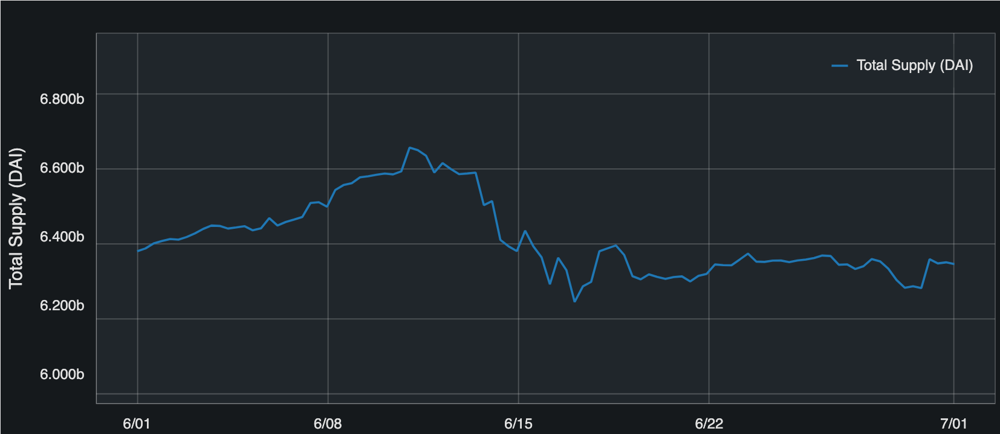
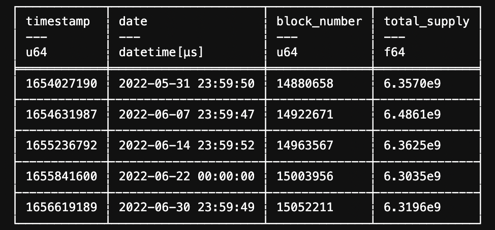
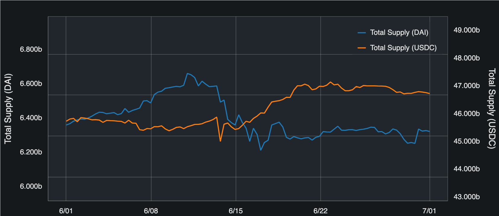
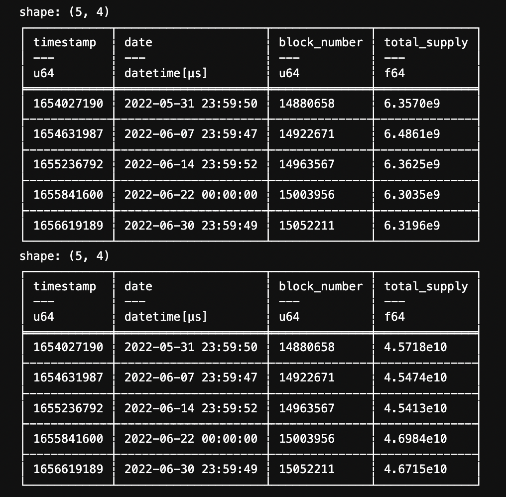
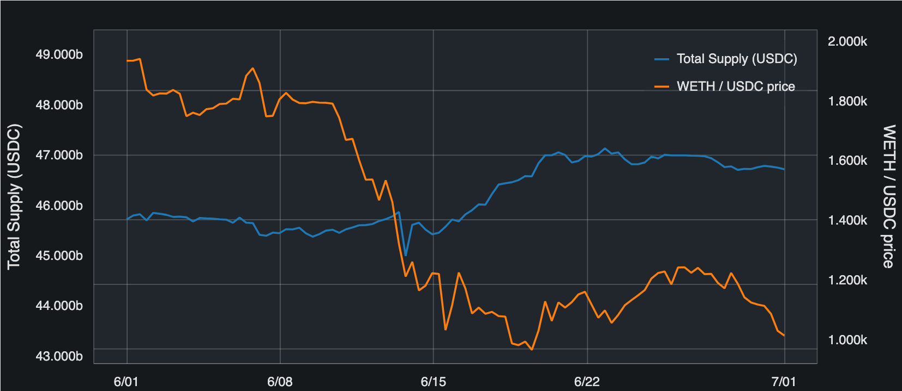
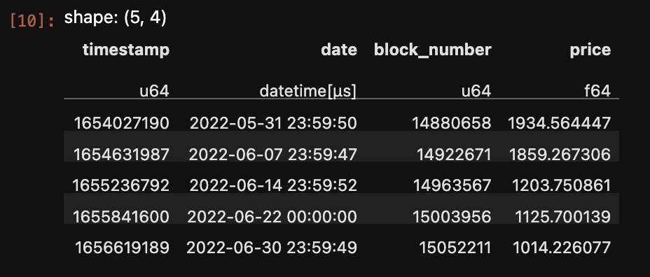

Cookbook
========

See `Getting started <getting-started.html>`_ for initial setup.

ERC20 total_supply history
--------------------------

.. code::

    from web3cat.view import View
    from datetime import datetime

    # visualization

    v = View(token="DAI", start=datetime(2022, 6, 1), end = datetime(2022, 7, 1)) \
        .total_supply()
    v.show()

.. code::    

    # data
    from web3cat.data import ERC20Data
    d = ERC20Data(token="DAI", address_filter = [], start=datetime(2022, 6, 1), end = datetime(2022, 7, 1))
    d.total_supply([datetime(2022, 6, 1), datetime(2022, 6, 8), datetime(2022, 6, 15), datetime(2022, 6, 22), datetime(2022, 7, 1)])

ERC20 total_supply history for many tokens
------------------------------------------

.. code::

    from web3cat.view import View
    from datetime import datetime

    # visualization

    v = View(start=datetime(2022, 6, 1), end = datetime(2022, 7, 1)) \
        .total_supply(token="DAI") \
        .total_supply(token="USDC")
    v.show()

.. code::    

    # data
        
    from web3cat.data import ERC20Data
    dates = [datetime(2022, 6, 1), datetime(2022, 6, 8), datetime(2022, 6, 15), datetime(2022, 6, 22), datetime(2022, 7, 1)]
    d_dai = ERC20Data(token="DAI", address_filter = [], start=datetime(2022, 6, 1), end = datetime(2022, 7, 1))
    d_usdc = ERC20Data(token="USDC", address_filter = [], start=datetime(2022, 6, 1), end = datetime(2022, 7, 1))

    print(d_dai.total_supply(dates))
    print(d_usdc.total_supply(dates))

ERC20 total_supply and price history
------------------------------------

.. code::

    from view import View
    from datetime import datetime

    # visualization

    v = View(start=datetime(2022, 6, 1), end = datetime(2022, 7, 1)) \
        .total_supply(token = "USDC") \
        .chainlink_prices(token="WETH", base_token = "USDC")
    v.show()

.. code::

    # data

    from data import ChainlinkData

    dates = [datetime(2022, 6, 1), datetime(2022, 6, 8), datetime(2022, 6, 15), datetime(2022, 6, 22), datetime(2022, 7, 1)]
    d = ChainlinkData(tokens = ["WETH", "USDC"], start=datetime(2022, 6, 1), end = datetime(2022, 7, 1))
    d.prices("WETH", "USDC", dates)    

