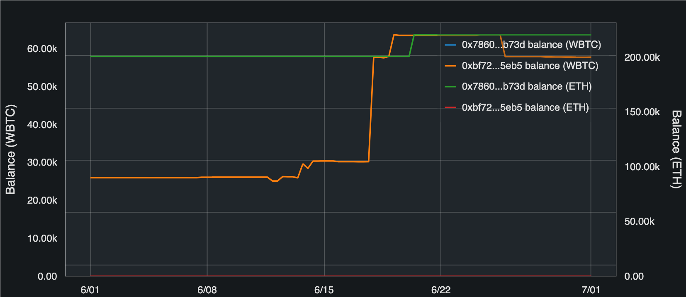
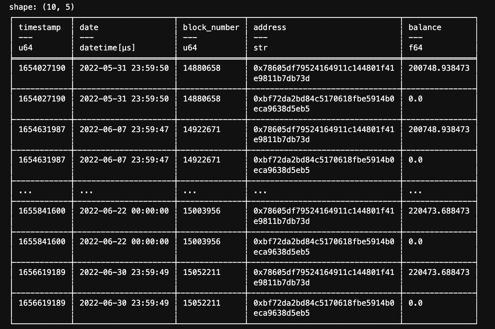
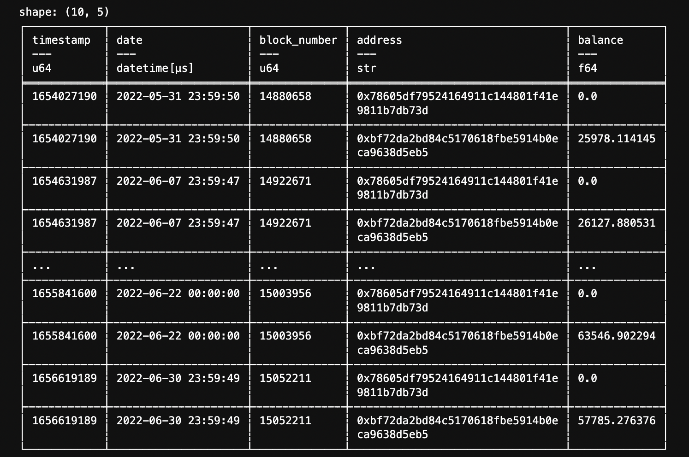
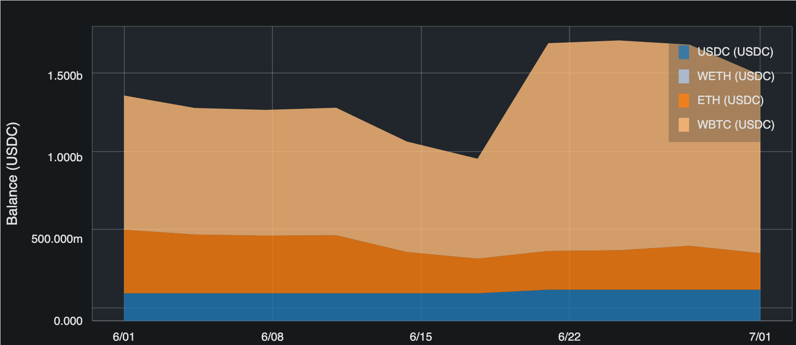
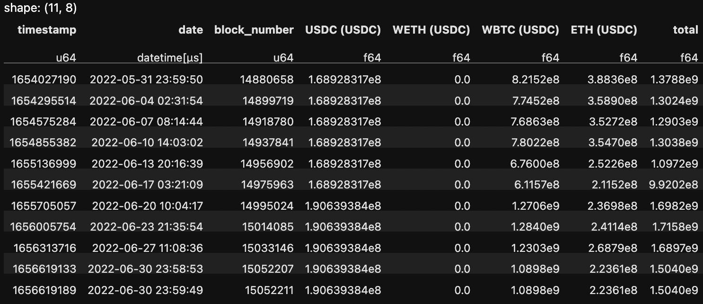
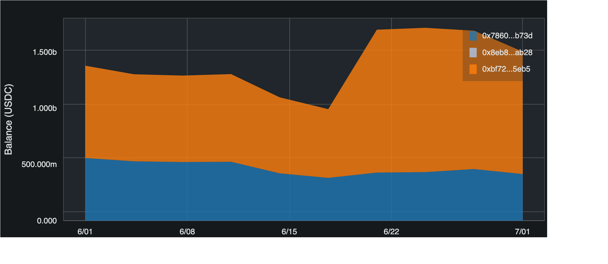
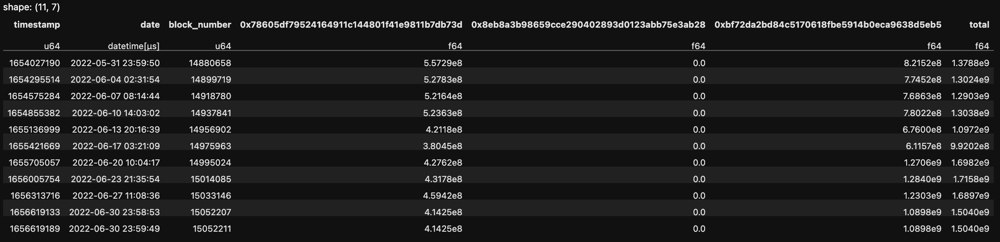

Cookbook
========

See `Getting started <getting-started.html>`_ for initial setup.

ERC20 total_supply history
--------------------------

.. code::

    from web3cat.view import View
    from datetime import datetime

    # visualization

    v = View(token="DAI", start=datetime(2022, 6, 1), end = datetime(2022, 7, 1)) \
        .total_supply()
    v.show()

.. image:: images/getting_started1.png

.. code::

    # data
    from web3cat.data import ERC20Data
    d = ERC20Data(token="DAI", address_filter = [], start=datetime(2022, 6, 1), end = datetime(2022, 7, 1))
    d.total_supply([datetime(2022, 6, 1), datetime(2022, 6, 8), datetime(2022, 6, 15), datetime(2022, 6, 22), datetime(2022, 7, 1)])

.. image:: images/getting_started1_2.png

ERC20 total_supply history for many tokens
------------------------------------------

.. code::

    from web3cat.view import View
    from datetime import datetime

    # visualization

    v = View(start=datetime(2022, 6, 1), end = datetime(2022, 7, 1)) \
        .total_supply(token="DAI") \
        .total_supply(token="USDC")
    v.show()

.. image:: images/getting_started2.png

.. code::

    # data

    from web3cat.data import ERC20Data
    dates = [datetime(2022, 6, 1), datetime(2022, 6, 8), datetime(2022, 6, 15), datetime(2022, 6, 22), datetime(2022, 7, 1)]
    d_dai = ERC20Data(token="DAI", address_filter = [], start=datetime(2022, 6, 1), end = datetime(2022, 7, 1))
    d_usdc = ERC20Data(token="USDC", address_filter = [], start=datetime(2022, 6, 1), end = datetime(2022, 7, 1))

    print(d_dai.total_supply(dates))
    print(d_usdc.total_supply(dates))

.. image:: images/getting_started2_2.png

Many charts on one axis
-----------------------

.. code::

    from web3cat.view import View
    from datetime import datetime

    v = View(y_axis_name="Total supply (USD)", start=datetime(2022, 6, 1), end = datetime(2022, 7, 1)) \
        .total_supply(token="DAI") \
        .total_supply(token="USDC") \
        .chainlink_prices(token="DAI", base_token = "USD", y_axis_name = "USD Price") \
        .chainlink_prices(token="USDC", base_token = "USD", y_axis_name = "USD Price")
    v.show()

.. image:: images/getting_started2_3.png

ERC20 total_supply and price history
------------------------------------

.. code::

    from web3cat.view import View
    from datetime import datetime

    # visualization

    v = View(start=datetime(2022, 6, 1), end = datetime(2022, 7, 1)) \
        .total_supply(token = "USDC") \
        .chainlink_prices(token="WETH", base_token = "USDC")
    v.show()

.. image:: images/getting_started3.png

.. code::

    # data

    from web3cat.data import ChainlinkData

    dates = [datetime(2022, 6, 1), datetime(2022, 6, 8), datetime(2022, 6, 15), datetime(2022, 6, 22), datetime(2022, 7, 1)]
    d = ChainlinkData(tokens = ["WETH", "USDC"], start=datetime(2022, 6, 1), end = datetime(2022, 7, 1))
    d.prices("WETH", "USDC", dates)

.. image:: images/getting_started3_2.png

ERC20 and ETH balance history
-----------------------------

.. code::

    from web3cat.view import View
    from datetime import datetime

    # visualization

    addresses = [
        "0x78605Df79524164911C144801f41e9811B7DB73D",
        "0xBF72Da2Bd84c5170618Fbe5914B0ECA9638d5eb5",
    ]

    v = View(start=datetime(2022, 6, 1), end = datetime(2022, 7, 1)) \
        .balance(token = "WBTC", address = addresses) \
        .balance(token = "ETH", address = addresses)
    v.show()

.. code::

    from web3cat.data import ERC20Data, EtherData

    addresses = [
        "0x78605Df79524164911C144801f41e9811B7DB73D",
        "0xBF72Da2Bd84c5170618Fbe5914B0ECA9638d5eb5",
    ]

    dates = [datetime(2022, 6, 1), datetime(2022, 6, 8), datetime(2022, 6, 15), datetime(2022, 6, 22), datetime(2022, 7, 1)]
    e_data = EtherData(start = datetime(2022, 6, 1), end = datetime(2022, 7, 1))
    u_data = ERC20Data(token="WBTC", address_filter=addresses, start = datetime(2022, 6, 1), end = datetime(2022, 7, 1))

    print(e_data.balances(addresses, dates))
    print(u_data.balances(addresses, dates))

Portfolio data breakdown by tokens
----------------------------------

.. code::

    from web3cat.view import View
    from datetime import datetime

    # visualization

    addresses = [
        "0x78605Df79524164911C144801f41e9811B7DB73D",
        "0xBF72Da2Bd84c5170618Fbe5914B0ECA9638d5eb5",
        "0x8EB8a3b98659Cce290402893d0123abb75E3ab28"
    ]
    tokens = ["USDC", "WETH", "ETH", "WBTC"]
    base_tokens = ["USDC", "WETH"]

    v = View().portfolio_by_token(
        addresses = addresses,
        tokens = tokens,
        base_token = "USDC",
        start=datetime(2022, 6, 1),
        end=datetime(2022, 7, 1),
        numpoints=10
    )
    v.show()

.. code::

    from web3cat.data import PortfolioData

    d = PortfolioData(
        tokens=tokens,
        base_tokens=base_tokens,
        addresses=addresses,
        start=datetime(2022, 6, 1),
        end=datetime(2022, 7, 1),
        numpoints=10
    )
    d.breakdown_by_token("USDC")

Portfolio data breakdown by addresses
-------------------------------------

.. code::

    from web3cat.view import View
    from datetime import datetime

    # visualization

    addresses = [
        "0x78605Df79524164911C144801f41e9811B7DB73D",
        "0xBF72Da2Bd84c5170618Fbe5914B0ECA9638d5eb5",
        "0x8EB8a3b98659Cce290402893d0123abb75E3ab28"
    ]
    tokens = ["USDC", "WETH", "ETH", "WBTC"]
    base_tokens = ["USDC", "WETH"]

    v = View().portfolio_by_address(
        addresses = addresses,
        tokens = tokens,
        base_token = "USDC",
        start=datetime(2022, 6, 1),
        end=datetime(2022, 7, 1),
        numpoints=10
    )
    v.show()

.. code::

    from web3cat.data import PortfolioData

    d = PortfolioData(
        tokens=tokens,
        base_tokens=base_tokens,
        addresses=addresses,
        start=datetime(2022, 6, 1),
        end=datetime(2022, 7, 1),
        numpoints=10
    )
    d.breakdown_by_address("USDC")

